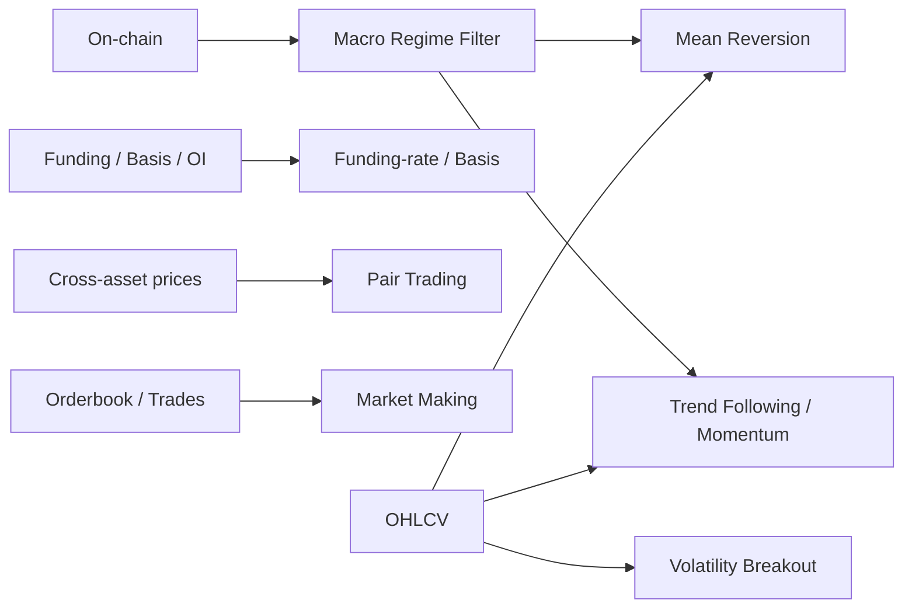

# 크립토 시장 퀀트 트레이딩 전략 분석 보고서

## 요약

최근 5년의 학술 논문, 거래소 공식 문서, 산업 리포트, 오픈소스 사례를 종합하면, 크립토에서 가장 실전성이 높은 전략군은 단일 전략 하나라기보다 **추세추종/모멘텀을 코어로 두고, funding/basis를 시장중립 수익원으로 병행하고, on-chain 또는 파생지표로 레짐 필터를 거는 조합**에 가깝다. 방향성 전략 중에서는 **liquid top-20 코인에 대한 Donchian/모멘텀 계열**이 가장 일관된 위험조정 성과를 보였고, 시장중립 쪽에서는 **funding-rate/basis arbitrage**가 비교적 안정적인 수익원으로 반복해서 등장했다. 반면 **mean reversion은 “급락 반등”에서 유효하지만 추세 하락장에서는 쉽게 깨지고**, **market making은 이론적으로 매력적이나 개인에게는 인프라 난도가 가장 높다**. on-chain 신호는 독립적인 초단기 알파보다는, **BTC/ETH의 중기 매크로 레짐 필터와 포지션 온·오프 스위치**로 쓸 때 가장 설득력이 높다. citeturn20view0turn11view0turn30search8turn32search0turn23view0turn46view0

## 범위와 판단 기준

이 보고서는 BTC/ETH를 포함한 크립토 전반을 대상으로 하고, 대표 거래소는 바이낸스·Bybit·OKX를 가정했다. 데이터 기간은 **최근 5년(가능한 경우 2021~2026, 또는 각 연구가 제공하는 최대 기간)**을 우선했고, 성과 수치는 **각 출처의 원래 실험 조건을 그대로 인용**했다. 따라서 샤프·승률·최대낙폭은 서로 직접 비교하기보다, “어떤 전략군이 어떤 환경에서 살아남았는가”를 보는 것이 더 타당하다. citeturn20view0turn21view0turn11view0turn28view0

아래의 실전 우선순위 평가는 **(가) 데이터 입수 용이성, (나) 수수료 차감 후 생존 가능성, (다) 구현 난도, (라) 레짐 취약성, (마) 개인/소규모 팀이 실제로 운영 가능한지**를 기준으로 한 종합 판단이다. 특히 추세추종은 liquid 코인군에서 위험조정성과가 강했고, funding arbitrage는 HODL과 상관이 낮은 안정형 대안으로 제시되며, market making은 큐 포지션·지연·오더북 독성 흐름을 모델링해야 해 소매 친화성이 가장 낮다. citeturn20view0turn11view0turn23view0turn36view8turn46view0

| 항목 | 기본 가정 |
|---|---|
| 자산 범위 | BTC, ETH, 상위 유동성 알트코인, 일부 퍼페추얼 선물 |
| 거래소 범위 | Binance / Bybit / OKX 중심 |
| 기간 | 최근 5년 우선, 부족하면 최대 가용 기간 |
| 내 예시 코드 비용 가정 | 현물/선물 taker 5bps/side, maker 1bps/side(또는 리베이트), 슬리피지 BTC/ETH 1~2bps, liquid 알트 3~10bps |
| 레버리지 기본값 | 1x, 단 funding/basis는 델타중립 또는 출처 기준 |
| 주의 | 논문/블로그 성과는 수수료·슬리피지 가정이 서로 다르며, 미기재일 경우 “미지정”으로 표기 |



## 전략별 심층 분석

전략별 표는 요청하신 항목을 모두 담되, **백테스트 수치의 출처가 제각각**이므로 “전략 간 절대 비교표”가 아니라 “전략군별 실전성 요약표”로 보는 것이 적절하다.

### Mean Reversion

BTC의 단기 급락 반등은 분명 존재하지만, 연구 결과를 그대로 읽으면 **“반등 전략만 단독으로 돌리기”보다는 강한 추세장에서는 쉬고, 과매도/공포 국면에서만 켜는 방식**이 훨씬 합리적이다. Quantpedia의 2022 BTC 연구에서는 로컬 10일 고점·저점 전략이 모두 작동했고, 둘을 결합한 전략은 연환산 수익률 98.43%, 변동성 47.75%, 최대낙폭 -37.67%, Ret/Vol 2.06을 기록했다. 그러나 2024 재검증에서는 2022-02~2024-08의 OOS 구간에서 **MIN(저점 반등) leg가 약화**되고 **MAX(신고가/고점 추세) leg가 상대적으로 견조**했다. 즉, “데드캣 바운스”는 크립토에서 실재하지만, **항상 사야 하는 패턴**은 아니라는 뜻이다. citeturn7view0turn9view0

| 항목 | 내용 |
|---|---|
| 전략명 | 급락 반등 / 로컬 저점 Mean Reversion |
| 전략 계열 | Mean Reversion / Short-term Reversal |
| 핵심 아이디어 | 가격이 rolling mean·rolling min 대비 과매도일 때 단기 반등 확률이 커진다. 다만 구조적 하락 추세에서는 “떨어지는 칼날”이 된다. |
| 사용 데이터 | OHLCV, ATR/변동성, RSI, 선택적으로 OI·funding·orderbook panic 지표 |
| 주요 지표/계산식 | `z = (price - rolling_mean) / rolling_std`, `RSI`, `ATR`, `rolling n-day low` |
| 백테스트 결과 | 대표 공개치: Quantpedia 결합 전략(2015-11~2022-02): 연환산 98.43%, 변동성 47.75%, MDD -37.67%, Ret/Vol 2.06. 단, 2022-02~2024-08 OOS에서는 반등 leg 약화 |
| 리스크·단점 | 하락 추세에서 연속 손실, 알트코인에서 노이즈 과다, 저유동 코인 슬리피지 큼 |
| 구현 난이도 | 초급~중급 |
| AI/ML 적용 여부 및 역할 | 가능. 반등 자체를 “예측”하기보다 레짐 필터(추세/변동성/공포), 확률 스코어링에 유리 |
| 실전 팁 | BTC/ETH·상위 유동성 코인부터 시작, 1h/4h/1d 우선, 200EMA 또는 장기 추세 필터와 함께 쓰는 것이 안전 |

우선 출처 URL
```text
https://quantpedia.com/revisiting-trend-following-and-mean-reversion-strategies-in-bitcoin/
https://quantpedia.com/trend-following-and-mean-reversion-in-bitcoin/
https://papers.ssrn.com/sol3/papers.cfm?abstract_id=4955617
https://github.com/hansen-han/crypto_backtesting_analysis
```

구현 시작 데이터는 단순하다. 처음에는 OHLCV만으로 충분하고, later stage에서 OI/funding/orderbook을 보조 필터로 붙이면 된다. 바이낸스/Bybit 공식 문서는 각각 선물 Kline을 제공한다. citeturn37view0turn36view3

| 데이터 샘플 | 예시 컬럼 | 타임프레임 |
|---|---|---|
| 가격 캔들 | `ts, open, high, low, close, volume` | 1h / 4h / 1d |
| 보조 변동성 | `atr14, realized_vol_20d` | 1h / 4h / 1d |
| 선택 필터 | `funding_rate, oi, premium` | 8h / 1h / 4h |

샘플 쿼리 예시
```text
GET https://fapi.binance.com/fapi/v1/klines?symbol=BTCUSDT&interval=4h&limit=1000
GET https://api.bybit.com/v5/market/kline?category=linear&symbol=BTCUSDT&interval=240&limit=1000
```

백테스트 핵심 로직 예시  
라이브러리: `pandas`, `numpy`

```python
import numpy as np
import pandas as pd

def backtest_mean_reversion(df, lookback=20, z_enter=-2.0, z_exit=-0.3,
                            trend_ma=200, fee_bps=5, slippage_bps=2):
    px = df["close"].copy()
    mean = px.rolling(lookback).mean()
    std = px.rolling(lookback).std()
    z = (px - mean) / std

    tr = pd.concat([
        df["high"] - df["low"],
        (df["high"] - px.shift(1)).abs(),
        (df["low"] - px.shift(1)).abs()
    ], axis=1).max(axis=1)
    atr = tr.rolling(14).mean()

    trend_ok = px > px.rolling(trend_ma).mean()
    panic = (atr / px) > 0.015
    entry = (z < z_enter) & trend_ok & panic
    exit_ = (z > z_exit) | (px < px.shift(1) * 0.97)

    pos = pd.Series(0.0, index=df.index)
    in_pos = False
    for i in range(len(df)):
        if not in_pos and entry.iloc[i]:
            in_pos = True
        elif in_pos and exit_.iloc[i]:
            in_pos = False
        pos.iloc[i] = 1.0 if in_pos else 0.0

    gross = pos.shift(1).fillna(0) * px.pct_change().fillna(0)
    trades = pos.diff().abs().fillna(0)
    cost = trades * (fee_bps + slippage_bps) / 1e4
    equity = (1 + gross - cost).cumprod()

    return pd.DataFrame({
        "close": px, "zscore": z, "atr": atr, "pos": pos, "equity": equity
    })
```

### Trend Following

최근 문헌에서 가장 일관되게 살아남는 방향성 전략은 **time-series momentum / trend following**이다. 2025년 *Catching Crypto Trends*는 Donchian 채널 기반의 다중 lookback 앙상블과 변동성 기반 포지션사이징을 liquid top-20 코인 rotation에 적용해 **net-of-fees Sharpe ratio 1.5 이상, BTC 대비 연율 alpha 10.8%**를 보고했다. 반면 2024년 Sungkyunkwan 연구는 **time-series momentum 증거는 강하지만 cross-sectional momentum은 현실적 가정(청산 위험, 일중 변동, 비용)을 넣으면 약하다**고 정리했다. Monash 연구도 trend following 자체는 작동하지만 **거래비용이 성과를 크게 깎는다**고 지적한다. citeturn20view0turn21view0turn22view0

| 항목 | 내용 |
|---|---|
| 전략명 | Time-Series Momentum / Trend Following |
| 전략 계열 | Trend Following / Momentum |
| 핵심 아이디어 | 일정 기간 상승한 자산은 중기적으로 추가 상승할 가능성이 높다. 신고가 돌파, 양(+)의 누적수익률, MA 상향배열이 대표 신호 |
| 사용 데이터 | 멀티자산 OHLCV, 유동성/거래대금, ATR/실현변동성 |
| 주요 지표/계산식 | `mom_n = close / close.shift(n) - 1`, SMA/EMA, Donchian upper/lower, ATR 기반 vol targeting |
| 백테스트 결과 | liquid top-20 rotation에 Donchian ensemble 적용 시 Sharpe > 1.5, BTC 대비 연율 alpha 10.8% (net-of-fees) |
| 리스크·단점 | 횡보장에서 whipsaw, 턴오버 증가, 알트 유동성 편차, 거래비용 민감 |
| 구현 난이도 | 중급 |
| AI/ML 적용 여부 및 역할 | HMM·RL·LLM을 추세 레짐 분류, 시그널 가중치 조정, execution overlay에 사용 가능 |
| 실전 팁 | 우선 BTC/ETH+상위 유동성 코인 5~20개, 4h/1d 중심, 변동성 타기팅과 유니버스 유동성 필터 필수 |

우선 출처 URL
```text
https://papers.ssrn.com/sol3/papers.cfm?abstract_id=5209907
https://papers.ssrn.com/sol3/papers.cfm?abstract_id=4675565
https://papers.ssrn.com/sol3/papers.cfm?abstract_id=4551518
https://concretumgroup.com/papers/
https://github.com/Charlyhno-eng/crypto-trend-following-strategy
```

추세추종은 단일 BTC보다 **멀티코인 rotation + 변동성 타기팅**이 실전적으로 더 낫다. 다만 거래비용이 커지므로, 유동성 상위 코인으로 universe를 제한하고 주기를 너무 짧게 잡지 않는 것이 중요하다. citeturn20view0turn22view0

| 데이터 샘플 | 예시 컬럼 | 타임프레임 |
|---|---|---|
| 멀티코인 캔들 | `ts, symbol, open, high, low, close, volume` | 4h / 1d |
| 유동성 필터 | `quote_volume, num_trades` | 4h / 1d |
| 리스크 관리 | `atr14, realized_vol_20d` | 1d |

샘플 쿼리 예시
```text
GET https://fapi.binance.com/fapi/v1/klines?symbol=ETHUSDT&interval=1d&limit=1000
GET https://fapi.binance.com/fapi/v1/klines?symbol=SOLUSDT&interval=1d&limit=1000
```

백테스트 핵심 로직 예시  
라이브러리: `pandas`, `numpy`

```python
import numpy as np
import pandas as pd

def backtest_tsmom(prices, lookback=60, vol_lookback=20, top_n=5, fee_bps=5):
    rets = prices.pct_change().fillna(0)
    mom = prices.pct_change(lookback)
    vol = rets.rolling(vol_lookback).std() * np.sqrt(365)

    signal = mom.where(mom > 0)  # 양의 추세만 채택
    rank = signal.rank(axis=1, ascending=False, method="first")
    weights = (rank <= top_n).astype(float)

    # 기본 equal weight 후 변동성 타기팅
    weights = weights.div(weights.sum(axis=1), axis=0).fillna(0)
    target_vol = 0.25
    scaled = (weights * (target_vol / vol).clip(upper=3.0))
    weights = scaled.div(scaled.sum(axis=1), axis=0).fillna(0)

    port_ret = (weights.shift(1).fillna(0) * rets).sum(axis=1)
    turnover = weights.diff().abs().sum(axis=1).fillna(0)
    cost = turnover * fee_bps / 1e4
    equity = (1 + port_ret - cost).cumprod()

    return pd.DataFrame({
        "portfolio_ret": port_ret,
        "turnover": turnover,
        "equity": equity
    })
```

### Funding-rate / Perpetual Basis

시장중립 관점에서 가장 실전성이 높은 축은 **spot–perp cash-and-carry 또는 funding-rate capture**다. 퍼페추얼의 funding은 선물과 현물 가격 괴리를 줄이기 위한 메커니즘이고, Binance와 Bybit는 각각 premium index와 clamp 함수로 funding을 계산한다. Binance는 극단적 시장에서는 **기본 8시간 주기를 1시간까지 줄일 수 있고**, 다시 조건이 완화되면 4시간으로 되돌릴 수 있으므로, “항상 8시간”이라고 가정하는 코드는 실전에서 깨지기 쉽다. 또한 2025년 연구는 CEX/DEX 60개 시나리오에서 funding arbitrage가 **6개월 최대 115.9% 수익, 최소 손실 1.92%**까지 보일 수 있다고 보고했고, 다른 이론 연구들은 implied arbitrage가 **높은 Sharpe**를 보인다고 설명한다. citeturn41view0turn36view1turn11view0turn43view0turn42view1turn43view1

| 항목 | 내용 |
|---|---|
| 전략명 | Positive Funding Capture / Spot-Perp Basis Arbitrage |
| 전략 계열 | Funding-based / Carry / Cash-and-Carry |
| 핵심 아이디어 | funding이 충분히 양(+)이고 basis가 과도하면 현물 long + perp short로 funding을 받으며 basis 수렴을 노린다. 음(-) funding이면 반대로 수행 가능 |
| 사용 데이터 | spot/perp OHLCV, funding history, premium index, mark price, index price, OI, 선택적으로 borrow rate |
| 주요 지표/계산식 | `basis = (perp - spot) / spot`, `annualized_funding ≈ funding_rate × settlements_per_year`, funding z-score |
| 백테스트 결과 | 대표 사례: 60 시나리오 분석에서 6개월 최대 115.9% 수익, 가능한 손실 최소 1.92%; 이론 연구는 implied arbitrage의 높은 Sharpe 제시 |
| 리스크·단점 | 거래소 신용위험, 현물 조달/차입비용, 펀딩 주기 변경, 양 leg 불일치, 급변 시 청산 |
| 구현 난이도 | 중급 |
| AI/ML 적용 여부 및 역할 | 심볼 선택, funding persistence 예측, venue allocation, crowding 회피 스코어에 유용 |
| 실전 팁 | BTC/ETH/SOL 등 최상위 유동성부터, funding interval 하드코딩 금지, borrow/수수료/출금 리스크까지 PnL에 반영 |

우선 출처 URL
```text
https://developers.binance.com/docs/derivatives/usds-margined-futures/market-data/rest-api/Get-Funding-Rate-History
https://www.binance.com/en/support/faq/detail/360033525031
https://bybit-exchange.github.io/docs/v5/market/history-fund-rate
https://www.bybit.com/en/announcement-info/fund-rate/
https://papers.ssrn.com/sol3/papers.cfm?abstract_id=4301150
https://papers.ssrn.com/sol3/papers.cfm?abstract_id=5036933
https://www.sciencedirect.com/science/article/pii/S2096720925000818
https://github.com/aoki-h-jp/funding-rate-arbitrage
```

바이낸스는 `GET /fapi/v1/fundingRate`로 funding history를, Bybit는 `GET /v5/market/funding/history`와 `GET /v5/market/open-interest`로 funding/OI를 제공한다. Bybit 문서도 심볼마다 funding interval이 다를 수 있다고 명시한다. citeturn36view0turn37view1turn36view4

| 데이터 샘플 | 예시 컬럼 | 타임프레임 |
|---|---|---|
| 현물/퍼프 가격 | `ts, spot_close, perp_close, mark_price, index_price` | 1m / 5m / 1h / 8h |
| funding/OI | `funding_rate, oi, premium_index` | 1h / 4h / 8h |
| 비용 | `borrow_rate, fee_rate, withdrawal_cost` | 일별/거래별 |

샘플 쿼리 예시
```text
GET https://fapi.binance.com/fapi/v1/fundingRate?symbol=BTCUSDT&limit=1000
GET https://api.bybit.com/v5/market/funding/history?category=linear&symbol=BTCUSDT&limit=200
GET https://api.bybit.com/v5/market/open-interest?category=linear&symbol=BTCUSDT&intervalTime=1h
```

백테스트 핵심 로직 예시  
라이브러리: `pandas`, `numpy`

```python
import numpy as np
import pandas as pd

def backtest_funding_arb(df, fr_thresh=0.0001, fee_bps=3, slippage_bps=1):
    # pos = 1 -> long spot / short perp
    spot_ret = df["spot_close"].pct_change().fillna(0)
    perp_ret = df["perp_close"].pct_change().fillna(0)

    basis = (df["perp_close"] - df["spot_close"]) / df["spot_close"]
    basis_mu = basis.rolling(30).mean()
    basis_sd = basis.rolling(30).std()
    basis_rich = basis > (basis_mu + 2 * basis_sd)

    long_spot_short_perp = (df["funding_rate"] > fr_thresh) | basis_rich
    pos = long_spot_short_perp.astype(float)

    # 델타중립 PnL: 현물 수익 - 퍼프 수익 + funding 수취
    delta_pnl = pos.shift(1).fillna(0) * (spot_ret - perp_ret)
    funding_pnl = pos.shift(1).fillna(0) * df["funding_rate"].fillna(0)

    borrow = df["borrow_rate"].fillna(0) if "borrow_rate" in df else 0.0
    trades = pos.diff().abs().fillna(0)
    cost = trades * (fee_bps + slippage_bps) / 1e4 + borrow

    equity = (1 + delta_pnl + funding_pnl - cost).cumprod()
    return pd.DataFrame({
        "basis": basis,
        "funding_rate": df["funding_rate"],
        "pos": pos,
        "equity": equity
    })
```

### Statistical Arbitrage / Pair Trading

크립토 pair trading은 “상관 높은 두 코인을 고르는 것”이 아니라, **장기 관계가 유지되는 spread를 고르고, 그 spread의 평균회귀를 거래하는 것**이다. 2024년 Rennes 연구는 2021-08~2024-01 동안 209개 자산에서 229개 pair를 식별해 테스트한 결과, 최적 전략의 **pair당 평균 연간 Sharpe 1.53**, **median max drawdown 29%**를 보고했다. 2023년 SSRN 논문은 cointegration 방식이 distance 방식보다 일반적으로 더 좋고, **intraday가 더 수익성 있지만 stop-loss를 넣으면 이점이 줄어든다**고 정리했다. 2021년 arXiv 연구는 realistic microstructure 가정 하에서 BitMEX 데이터로 naive buy-and-hold를 능가했다고 보고한다. citeturn28view0turn45view1turn13search5

| 항목 | 내용 |
|---|---|
| 전략명 | Cointegration Pair Trading |
| 전략 계열 | Statistical Arbitrage / Pair Trading |
| 핵심 아이디어 | 두 자산 가격의 선형결합(spread)이 정상성/평균회귀를 보이면, spread의 과도한 이탈을 숏/롱으로 거래 |
| 사용 데이터 | 두 자산 OHLCV, 가능하면 bid/ask 및 체결 데이터, 유동성/거래량 |
| 주요 지표/계산식 | `spread = log(P1) - β log(P2)`, `z = (spread - mean) / std`, OU half-life, ADF/Engle-Granger/Johansen |
| 백테스트 결과 | 2024 연구: pair당 평균 연간 Sharpe 1.53, median MDD 29%; 2023 연구: cointegration > distance, intraday 우위 |
| 리스크·단점 | cointegration 붕괴, regime shift, 공통 요인 급변, 저유동 pair 슬립 확산 |
| 구현 난이도 | 중급~고급 |
| AI/ML 적용 여부 및 역할 | pair selection, cluster 생성, threshold 최적화, RL 기반 position scaling에 적합 |
| 실전 팁 | 유사 섹터/레거시 체인/동일 베타 군 위주, 주기적 재선정 필요, bid/ask 기준 백테스트 필수 |

우선 출처 URL
```text
https://arxiv.org/abs/2109.10662
https://papers.ssrn.com/sol3/papers.cfm?abstract_id=4433530
https://ideas.repec.org/p/tut/cremwp/2024-11.html
https://github.com/amberdata/jupyter-notebook/blob/master/market/Cointegration%20Based%20Crypto%20Pairs%20Trading%20Strategy.ipynb
```

실전에서 가장 많이 놓치는 부분은 **“close-to-close spread”보다 bid/ask 기준 체결 손익이 훨씬 나쁘다**는 점이다. 그래서 논문들도 formation period는 price data로 보더라도, live simulation 쪽은 quoted spread와 체결 가능성을 반영하려고 한다. citeturn13search5turn45view1

| 데이터 샘플 | 예시 컬럼 | 타임프레임 |
|---|---|---|
| 자산 A/B 가격 | `ts, A_close, B_close, A_volume, B_volume` | 5m / 1h / 1d |
| 현실적 체결 | `A_bid, A_ask, B_bid, B_ask` | 초~분 |
| 통계 추정 | `beta, spread, zscore, half_life` | 추정 window 기준 |

샘플 쿼리 예시
```text
GET https://fapi.binance.com/fapi/v1/klines?symbol=BTCUSDT&interval=1h&limit=1000
GET https://fapi.binance.com/fapi/v1/klines?symbol=ETHUSDT&interval=1h&limit=1000
GET https://fapi.binance.com/fapi/v1/depth?symbol=BTCUSDT&limit=100
```

백테스트 핵심 로직 예시  
라이브러리: `pandas`, `numpy`

```python
import numpy as np
import pandas as pd

def rolling_beta(y, x, window):
    beta = pd.Series(index=y.index, dtype=float)
    for i in range(window, len(y)):
        yy = y.iloc[i - window:i].values
        xx = x.iloc[i - window:i].values
        X = np.column_stack([np.ones(window), xx])
        b = np.linalg.lstsq(X, yy, rcond=None)[0][1]
        beta.iloc[i] = b
    return beta.ffill()

def backtest_pairs(df, window=120, entry=2.0, exit=0.5, fee_bps=5):
    y = np.log(df["A_close"])
    x = np.log(df["B_close"])
    beta = rolling_beta(y, x, window)

    spread = y - beta * x
    z = (spread - spread.rolling(window).mean()) / spread.rolling(window).std()

    state, pos = 0, []
    for zi in z.fillna(0):
        if state == 0 and zi < -entry:
            state = 1      # long spread: long A / short B
        elif state == 0 and zi > entry:
            state = -1     # short spread
        elif state == 1 and zi > -exit:
            state = 0
        elif state == -1 and zi < exit:
            state = 0
        pos.append(state)
    pos = pd.Series(pos, index=df.index, dtype=float)

    ret_a = df["A_close"].pct_change().fillna(0)
    ret_b = df["B_close"].pct_change().fillna(0)
    gross = pos.shift(1).fillna(0) * (ret_a - beta.shift(1).fillna(method="ffill") * ret_b)
    cost = pos.diff().abs().fillna(0) * fee_bps / 1e4
    equity = (1 + gross - cost).cumprod()

    return pd.DataFrame({"spread": spread, "zscore": z, "pos": pos, "equity": equity})
```

### Market Making

시장조성은 “매수/매도 호가를 양쪽에 내고 spread를 먹는다”는 말로 요약되지만, 실전에서는 **독성 주문흐름(adverse selection), 재고 리스크(inventory), 큐 포지션(queue position), 지연(latency)**이 핵심이다. 2025년 *Market Making in Crypto*는 퍼페추얼 시장에서 Bar Portion(BP)이라는 알파를 만들고 Hummingbot을 사용해 파라미터를 조정한 뒤, **SOL-USDT, DOGE-USDT, GALA-USDT를 24시간 실거래하여 BP가 MACD baseline을 상회**했다고 보고했다. Hummingbot은 Avellaneda-Stoikov, Cross-Exchange MM, Perpetual MM을 공개 전략으로 제공하고, 현실적인 HFT/market-making 백테스트 엔진 쪽에서는 **queue·latency·L2/L3 orderbook**를 모델링하는 `hftbacktest`류가 중요하다고 본다. citeturn23view0turn36view8turn36view9turn36view10turn46view0

| 항목 | 내용 |
|---|---|
| 전략명 | Avellaneda-Stoikov / Perp Market Making |
| 전략 계열 | Market Making / Liquidity Provision |
| 핵심 아이디어 | mid 주변에 양방향 호가를 내고 spread와 maker rebate를 수취하되, inventory에 따라 호가를 비틀어 재고를 관리 |
| 사용 데이터 | L2/L3 orderbook, trades, fill, latency, queue position, fee schedule |
| 주요 지표/계산식 | reservation price, half-spread, orderbook imbalance, fill ratio, inventory skew |
| 백테스트 결과 | 공개 abstract 기준: SOL-USDT·DOGE-USDT·GALA-USDT 24시간 실거래에서 BP가 MACD보다 우수. 세부 Sharpe/MDD는 공개 abstract에 미기재 |
| 리스크·단점 | adverse selection, 재고 폭주, 급변동 손실, API 지연, low-latency 인프라 필요 |
| 구현 난이도 | 고급 |
| AI/ML 적용 여부 및 역할 | microstructure alpha, mid-price prediction, quote skew, cancellation policy 최적화에 적합 |
| 실전 팁 | tick/L2 데이터 없으면 본격 MM 금지, maker rebate 구조 꼭 확인, 심볼별 quote width·inventory limit 분리 운영 |

우선 출처 URL
```text
https://papers.ssrn.com/sol3/papers.cfm?abstract_id=5066176
https://hummingbot.org/strategies/v1-strategies/avellaneda-market-making/
https://hummingbot.org/strategies/v1-strategies/cross-exchange-market-making/
https://hummingbot.org/strategies/v1-strategies/perpetual-market-making/
https://github.com/hummingbot/hummingbot
https://github.com/nkaz001/hftbacktest
```

Hummingbot 문서는 Avellaneda-Stoikov의 `gamma`, `alpha`, `kappa` 개념을 그대로 실전 파라미터로 노출하고 있으며, XEMM은 **유동성 큰 taker 시장에서 헷지하고 유동성 작은 maker 시장에 호가를 내는 구조**를 설명한다. 이런 전략은 1분 봉으로 대충 백테스트하면 과대평가되기 쉽다. citeturn36view8turn36view9turn46view0

| 데이터 샘플 | 예시 컬럼 | 타임프레임 |
|---|---|---|
| 오더북 스냅샷 | `ts, bid_px1..N, bid_sz1..N, ask_px1..N, ask_sz1..N` | 100ms~1s |
| 체결 데이터 | `trade_ts, price, size, side` | tick |
| 거래 비용 | `maker_fee, taker_fee, rebate, latency_ms` | 거래소별 |

샘플 쿼리 예시
```text
GET https://fapi.binance.com/fapi/v1/depth?symbol=BTCUSDT&limit=1000
GET https://api.bybit.com/v5/market/orderbook?category=linear&symbol=BTCUSDT&limit=200
WS  wss://fstream.binance.com/stream?streams=btcusdt@depth@100ms
```

백테스트 핵심 로직 예시  
라이브러리: `pandas`, `numpy`  
주의: 아래 코드는 **교육용 바(bar) 기반 toy model**이다. 실제 MM은 queue/latency/tick fill 모델이 반드시 필요하다. citeturn46view0turn36view8

```python
import numpy as np
import pandas as pd

def backtest_bar_market_maker(df, spread_bps=8, gamma=0.10,
                              clip_inv=5.0, qty=1.0,
                              maker_fee_bps=-1, taker_fee_bps=5):
    cash, inv = 0.0, 0.0
    vol = df["close"].pct_change().rolling(50).std().fillna(0)
    equity = []

    for i, row in df.iterrows():
        mid = row["close"]
        inv_skew = gamma * inv * vol.loc[i] * mid
        bid = mid * (1 - spread_bps / 2 / 1e4) - inv_skew
        ask = mid * (1 + spread_bps / 2 / 1e4) - inv_skew

        # 단순 fill 가정: bar low/high가 quote를 통과하면 체결
        if row["low"] <= bid:
            cash -= bid * qty * (1 + maker_fee_bps / 1e4)
            inv += qty
        if row["high"] >= ask:
            cash += ask * qty * (1 - maker_fee_bps / 1e4)
            inv -= qty

        # inventory kill-switch
        if abs(inv) > clip_inv:
            cash += (-np.sign(inv) * mid * abs(inv)) * (1 - taker_fee_bps / 1e4)
            inv = 0.0

        equity.append(cash + inv * mid)

    return pd.DataFrame({"equity": equity}, index=df.index)
```

### Volatility Breakout

Breakout은 추세추종의 하위 갈래라고 보는 것이 가장 정확하다. 핵심은 **조용한 구간에서 변동성이 눌렸다가, 방향성을 가진 확장으로 넘어갈 때 진입**하는 것이다. 2025년 *Catching Crypto Trends*는 Donchian channel 앙상블과 변동성 기반 size control을 broad crypto에 적용해 Sharpe > 1.5를 제시했다. 2026년 Donchian+ATR 연구는 BTC 일봉으로 **ATR 기반 변동성 필터와 ATR 리스크관리**를 얹은 구조를 다루며, 2024 Monash 연구도 trend following 성과가 살아 있지만 비용이 성과를 크게 훼손한다고 정리했다. 즉, breakout은 살아 있지만 **“신호보다 거래비용”이 실전 차이를 만든다**. citeturn20view0turn25search1turn25search2turn22view0

| 항목 | 내용 |
|---|---|
| 전략명 | Donchian / ATR Volatility Breakout |
| 전략 계열 | Volatility Breakout / Breakout Trend |
| 핵심 아이디어 | N-bar 고점·저점 돌파 시 추세 시작으로 보고 진입, ATR로 변동성 레짐 필터와 손절폭을 조정 |
| 사용 데이터 | OHLCV, ATR, 선택적으로 거래량·OI·funding confirmation |
| 주요 지표/계산식 | `upper = rolling_max(high, n)`, `lower = rolling_min(low, n)`, `ATR`, `ATR-based trailing stop` |
| 백테스트 결과 | broad crypto Donchian ensemble: Sharpe > 1.5, BTC 대비 alpha 10.8%(trend paper와 중첩). BTC Donchian+ATR 연구는 2026년에 추가 검증 |
| 리스크·단점 | false breakout, 뉴스성 급등락, 횡보장 잦은 손절, 비용 민감 |
| 구현 난이도 | 초급~중급 |
| AI/ML 적용 여부 및 역할 | fake breakout 판별, volatility expansion 예측, volume/OI confirmation 분류기에 적합 |
| 실전 팁 | 소매는 4h/1d 우선, 1m~5m breakout은 비용/슬립이 크므로 주의, ATR stop·time stop 병행 권장 |

우선 출처 URL
```text
https://papers.ssrn.com/sol3/papers.cfm?abstract_id=5209907
https://papers.ssrn.com/sol3/papers.cfm?abstract_id=6272239
https://concretumgroup.com/papers/
https://pyquantlab.medium.com/a-donchian-channel-breakout-strategy-a-simple-trend-following-approach-18b7b74c4358
```

| 데이터 샘플 | 예시 컬럼 | 타임프레임 |
|---|---|---|
| 캔들 | `ts, open, high, low, close, volume` | 4h / 1d |
| 변동성 | `atr14, atr_pct, realized_vol` | 4h / 1d |
| 보조 확인 | `oi_change, funding_rate, volume_spike` | 1h / 4h |

샘플 쿼리 예시
```text
GET https://fapi.binance.com/fapi/v1/klines?symbol=BTCUSDT&interval=1d&limit=1000
GET https://fapi.binance.com/fapi/v1/klines?symbol=ETHUSDT&interval=4h&limit=1000
```

백테스트 핵심 로직 예시  
라이브러리: `pandas`, `numpy`

```python
import numpy as np
import pandas as pd

def backtest_breakout(df, n=20, atr_mult=2.0, fee_bps=5):
    px = df["close"]
    upper = df["high"].rolling(n).max().shift(1)
    lower = df["low"].rolling(n).min().shift(1)

    tr = pd.concat([
        df["high"] - df["low"],
        (df["high"] - px.shift(1)).abs(),
        (df["low"] - px.shift(1)).abs()
    ], axis=1).max(axis=1)
    atr = tr.rolling(14).mean()
    vol_ok = (atr / px).between(0.01, 0.08)

    pos = pd.Series(0.0, index=df.index)
    stop = pd.Series(np.nan, index=df.index)
    in_pos = False

    for i in range(len(df)):
        if not in_pos and vol_ok.iloc[i] and px.iloc[i] > upper.iloc[i]:
            in_pos = True
            stop.iloc[i] = px.iloc[i] - atr_mult * atr.iloc[i]
        elif in_pos:
            prev_stop = stop.iloc[i - 1] if i > 0 else np.nan
            stop.iloc[i] = np.nanmax([prev_stop, px.iloc[i] - atr_mult * atr.iloc[i]])
            if px.iloc[i] < stop.iloc[i] or px.iloc[i] < lower.iloc[i]:
                in_pos = False
        pos.iloc[i] = 1.0 if in_pos else 0.0

    gross = pos.shift(1).fillna(0) * px.pct_change().fillna(0)
    cost = pos.diff().abs().fillna(0) * fee_bps / 1e4
    equity = (1 + gross - cost).cumprod()

    return pd.DataFrame({"upper": upper, "lower": lower, "atr": atr, "pos": pos, "equity": equity})
```

### On-chain Signal

on-chain 지표는 “틱 단위 트레이딩 신호”보다는 **BTC/ETH의 매크로 밸류에이션·사이클·투자자 손익 상태**를 읽는 데 적합하다. Glassnode는 MVRV를 시가총액/실현총액 비율로, MVRV Z-score를 `(market cap - realized cap) / std(market cap)`로 정의하고, SOPR는 온체인에서 이동한 코인의 실현 손익 비율로 설명한다. Glassnode의 2025 주간 분석은 **1년 MVRV Z-score가 강세장 국지/대세 고점에서 대체로 +2σ, 저점에서는 -1.5σ 부근**을 포착한다고 제시했다. 더 나아가 2026년 연구는 **MVRV Z-score를 활용한 룰 기반 전략이 buy-and-hold보다 더 높은 annualized log return, Sharpe, cumulative return**을 보였다고 보고했고, 2025년 연구는 on-chain 데이터가 BTC 방향성 예측에 유의미한 정보를 준다고 평가했다. citeturn38view2turn36view6turn38view3turn30search8turn32search0turn17search3

| 항목 | 내용 |
|---|---|
| 전략명 | MVRV / SOPR / Exchange Flow Regime Filter |
| 전략 계열 | On-chain Signal / Alternative Data / Macro Timing |
| 핵심 아이디어 | 투자자 평균 취득원가, 실현손익, 거래소 유입·유출이 사이클 국면과 공급 압력을 드러낸다 |
| 사용 데이터 | MVRV, MVRV Z-score, SOPR, Exchange Net Position Change, 실현손익, 선택적으로 ETF 흐름 |
| 주요 지표/계산식 | `MVRV = market_cap / realized_cap`, `MVRV_Z = (market_cap - realized_cap) / std(market_cap)`, `SOPR` |
| 백테스트 결과 | 2026 연구: MVRV Z-score 룰 전략이 B&H보다 annualized log return, Sharpe, cumulative return 우위. 2025 Glassnode: +2σ/−1.5σ 구간이 사이클 전환점에 유용 |
| 리스크·단점 | 저빈도·느린 신호, 공급자별 정의 차이, BTC 중심성 강함, 벤더 종속성 |
| 구현 난이도 | 중급 |
| AI/ML 적용 여부 및 역할 | on-chain + TA + derivatives 결합 분류기/할당 모델에서 유용 |
| 실전 팁 | 일봉·주봉 우선, 독립 전략보다 trend 전략의 on/off 필터로 사용, 먼저 BTC만 다룬 뒤 ETH로 확장 |

우선 출처 URL
```text
https://docs.glassnode.com/basic-api/endpoints/market
https://docs.glassnode.com/guides-and-tutorials/metric-guides/sopr/sopr-spent-output-profit-ratio
https://docs.glassnode.com/basic-api/endpoints/distribution
https://insights.glassnode.com/the-week-onchain-week-02-2025/
https://www.sciencedirect.com/science/article/pii/S0275531926002138
https://www.sciencedirect.com/science/article/pii/S266682702500057X
https://github.com/bitcoinresearchkit/brk
```

| 데이터 샘플 | 예시 컬럼 | 타임프레임 |
|---|---|---|
| 가격 | `ts, close` | 1d / 1w |
| 온체인 밸류에이션 | `mvrv, mvrv_z_score, realized_price` | 1d |
| 투자자 손익 | `sopr, net_realized_pnl` | 1d |
| 거래소 흐름 | `exchange_net_position_change` | 1d / 30d |

샘플 쿼리 예시
```text
GET https://api.glassnode.com/v1/metrics/market/mvrv_z_score?a=BTC&i=24h&api_key=YOUR_KEY
GET https://api.glassnode.com/v1/metrics/market/mvrv?a=BTC&i=24h&api_key=YOUR_KEY
GET https://api.glassnode.com/v1/metrics/distribution/exchange_net_position_change?a=BTC&api_key=YOUR_KEY
GET https://api.glassnode.com/v1/metrics/indicators/sopr?a=BTC&api_key=YOUR_KEY
```

백테스트 핵심 로직 예시  
라이브러리: `pandas`, `numpy`

```python
import numpy as np
import pandas as pd

def backtest_onchain_filter(df, fee_bps=5):
    # df columns: close, mvrv_z, sopr, exch_net_pos_change
    long_sig = (
        (df["mvrv_z"] < -1.0) |
        ((df["sopr"] < 1.0) & (df["sopr"].diff() > 0) & (df["exch_net_pos_change"] < 0))
    )
    flat_sig = (
        (df["mvrv_z"] > 2.0) |
        ((df["sopr"] > 1.05) & (df["exch_net_pos_change"] > 0))
    )

    pos = pd.Series(0.0, index=df.index)
    in_pos = False
    for i in range(len(df)):
        if not in_pos and long_sig.iloc[i]:
            in_pos = True
        elif in_pos and flat_sig.iloc[i]:
            in_pos = False
        pos.iloc[i] = 1.0 if in_pos else 0.0

    ret = pos.shift(1).fillna(0) * df["close"].pct_change().fillna(0)
    cost = pos.diff().abs().fillna(0) * fee_bps / 1e4
    equity = (1 + ret - cost).cumprod()

    return pd.DataFrame({
        "mvrv_z": df["mvrv_z"],
        "sopr": df["sopr"],
        "pos": pos,
        "equity": equity
    })
```

## AI 활용과 구현 로드맵

AI/ML은 크립토에서도 유용하지만, 최근 자료를 보면 **“전략을 처음부터 AI로 만들기”보다 “검증된 규칙 기반 전략 위에 AI를 얹기”가 훨씬 성공확률이 높다**. 2025년 RL 연구는 비트코인에서 기술적 전략 선택 문제를 DQN으로 풀었고, 2024년 RL pair trading 연구는 전통적 규칙 대비 동적 스케일링을 탐구했으며, 2025년 온체인+TA 입력 연구는 단순 시계열/ML이 DL보다 오히려 나은 경우도 많다고 보고했다. 또 2025년 Concretum의 LLM momentum 연구는 뉴스 기반 LLM 스코어가 기존 모멘텀 전략의 위험조정성과를 개선할 수 있음을 시사했다. 즉 AI의 베스트 프랙티스는 **(가) 레짐 필터, (나) 시그널 가중치, (다) 실행 오버레이, (라) 포트폴리오 최적화, (마) 리스크 이상치 탐지** 쪽이다. citeturn33search0turn13search17turn17search5turn47view0

개인 개발자 기준 권장 구현 순서는 아래와 같다. 첫 단계에서 market making으로 바로 가는 것은 권하지 않는다. funding·pair trading도 좋아 보이지만, 처음엔 **일봉/4시간봉의 추세추종 또는 레짐 필터형 mean reversion**이 가장 빨리 “끝까지 돌아가는 시스템”을 만들게 해준다. 바이낸스·Bybit의 공식 Kline, funding, OI 엔드포인트와 Glassnode의 MVRV/SOPR 계열만 있어도 꽤 많은 실험이 가능하다. citeturn37view0turn37view1turn36view4turn38view0turn36view6

| 단계 | 추천 우선순위 | 이유 | 권장 스택 |
|---|---|---|---|
| 시작 단계 | Trend Following + On-chain Filter | 가장 검증된 directional 코어, 데이터가 가장 쉽다 | `ccxt`, `pandas`, `vectorbt/backtrader` |
| 두 번째 | Mean Reversion with Regime Filter | 반등형 보조전략, 시장 급락 대응용 | OHLCV + ATR + funding/OI |
| 세 번째 | Funding / Basis | 시장중립 수익원 추가 | spot+perp 데이터, funding, OI, borrow |
| 네 번째 | Pair Trading | 통계적 시장중립 확장 | rolling OLS, ADF/Johansen, bid/ask |
| 마지막 | Market Making | 인프라·백테스트 난도 가장 높음 | L2/L3, tick DB, queue simulator |

한 문장으로 정리하면, **“규칙 기반 베이스라인 → 비용 반영 워크포워드 → 레짐 필터용 AI → 실행 자동화”** 순서가 가장 안전하다.

## 실전 체크리스트

특히 파생·오더북 전략은 “전략 아이디어”보다 **운영 품질**이 수익률을 더 크게 좌우한다. 바이낸스는 funding interval과 cap/floor가 극단적 상황에서 바뀔 수 있다고 명시하고 있고, 현실적인 HFT backtester들은 큐 포지션과 지연을 모델링해야 한다고 전제한다. 이 두 가지가 빠진 백테스트는 funding과 market making에서 특히 위험하다. citeturn41view0turn46view0

| 점검 영역 | 체크 항목 | 권장 기준 / 예시 |
|---|---|---|
| 데이터 품질 | 타임존 통일, 결측 캔들, 심볼 상폐/교체, 중복 체결 제거 | UTC 기준 정규화, 결측률 로그 저장, 상폐 자산은 survivorship bias 방지 |
| 비용 가정 | maker/taker, rebate, funding, borrow, 출금/전송 비용 | 전략별 비용 분리. funding/basis는 borrow·전송 비용 반드시 반영 |
| 슬리피지 | 참여율(participation rate), spread percentile, 알트 유동성 충격 | 단순 고정 bps 대신 거래대금 비율 또는 L2 depth 기반 함수 사용 |
| 레버리지 | gross/net exposure, 유지증거금, liquidation buffer | 기본 1x 시작, perp 전략도 강제청산 buffer 최소 2~3배 확보 |
| 레짐 필터 | 추세/횡보/변동성 압축·확장 구분 | trend는 sideways 회피, mean reversion은 강한 하락추세 회피 |
| 포지션사이징 | vol targeting, ATR stop, 포트폴리오 concentration cap | 단일 코인 10~20% cap, 포트폴리오 target vol 15~25%부터 |
| 백테스트 검증 | IS/OOS 분리, walk-forward, parameter stability | 최적화 파라미터가 이웃 구간에서 급변하지 않는지 확인 |
| 실행 엔진 | 재시도, 중복주문 방지, idempotency, clock sync | 서버 시간 동기화, 주문 상태 폴링+웹소켓 이중화 |
| 모니터링 | PnL attribution, hit ratio, turnover, funding capture, fill ratio | “왜 벌었는지”를 추적. alpha vs rebate vs carry vs basis 분리 |
| 이상징후 탐지 | latency spike, fill 급감, 예상 funding 미수취, spread 확대 | kill-switch, 심볼별 circuit breaker, 거래소 장애 fallback |
| 운영 자동화 | 재기동, 로그, 알람, 일일 리포트 | Slack/Telegram 알림, 일일 손익/노출/에러 리포트 자동화 |
| 벤더 리스크 | 거래소 신용리스크, 스테이블코인 리스크, 데이터 벤더 종속 | 자산 분산, 거래소 분산, 온체인/시장 데이터 소스 이중화 |
| 실험 관리 | 버전 관리, 실험 seed, 파라미터 히스토리 | config와 결과를 함께 저장, 재현 가능한 워크플로 유지 |

실전적으로 가장 권하는 출발점은 이렇다. **BTC/ETH 1d 또는 4h 데이터로 추세추종 하나, 급락 반등 하나, on-chain 필터 하나를 만든 뒤**, 수수료·슬리피지를 넣어서 워크포워드로 검증한다. 그 다음에만 funding/basis나 pair trading으로 확장하고, market making은 마지막 단계로 미루는 편이 거의 항상 더 빠르고 더 안전하다. citeturn20view0turn9view0turn11view0turn28view0turn23view0
